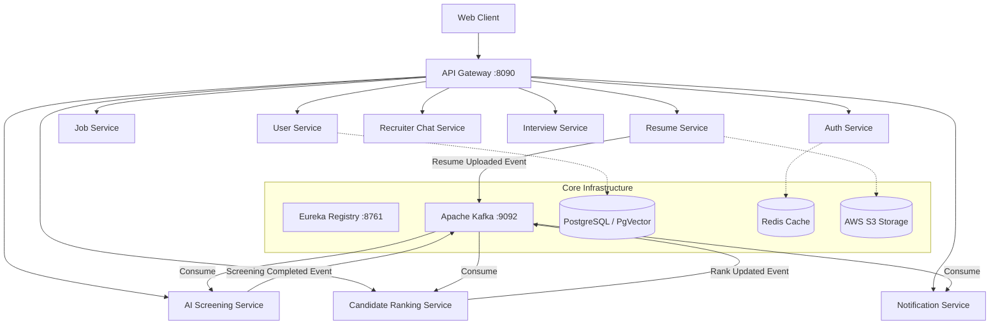
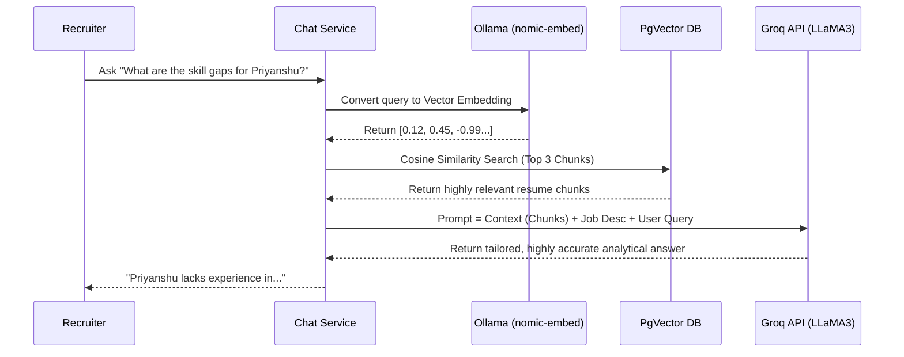

<div align="center">
  <h1>🚀 TalentIQ - Enterprise AI-Powered Screening & RAG Chatbot</h1>
  <p><strong>A highly scalable, event-driven Microservices architecture for automated Resume Parsing, AI Screening, Candidate Ranking, and Conversational RAG.</strong></p>
</div>

---

## 📖 Overview
TalentIQ is an enterprise-grade, distributed AI-screening platform built to revolutionize the recruitment process. Utilizing **Java 21 Spring Boot**, **Apache Kafka**, **PostgreSQL (PgVector)**, and **Large Language Models (Groq LLaMA3 & local Ollama)**, it solves the problem of manual resume screening. 

The system asynchronously ingests resumes, parses them via Apache Tika, processes them through an event-driven Kafka architecture, and leverages AI to rank candidates against Active Job Descriptions. It also features a built-in **Recruiter Chatbot** powered by a highly accurate RAG (Retrieval-Augmented Generation) pipeline to dynamically query candidate profiles.

---

## 🏗️ The 11 Microservices Architecture
The system is built on a pure distributed architecture consisting of **11 specialized microservices** coordinated by an API Gateway and Eureka Service Registry.

1. **`api-gateway`**: Centralized entry point, routing, and CORS management.
2. **`eureka-server`**: Dynamic service discovery and registration.
3. **`authentication-service`**: JWT-based secure login and token issuance.
4. **`user-management-service`**: Handles user roles (Recruiter, Candidate) and profiles.
5. **`job-description-service`**: Manages job postings and required skill criteria.
6. **`resume-management-service`**: Uploads resumes to S3, parses PDFs via Tika, and triggers Kafka events.
7. **`ai-screening-service`**: Core AI engine. Analyzes resumes against jobs using Groq LLM and generates Vector Embeddings using Ollama.
8. **`candidate-ranking-service`**: Computes compatibility scores and maintains dynamic leaderboards.
9. **`recruiter-chat-service`**: Conversational RAG interface allowing recruiters to chat with candidate resumes.
10. **`interview-scheduling-service`**: Manages interview slots and calendaring.
11. **`notification-service`**: Dispatches asynchronous email/system alerts to users.

---

## 🧩 Advanced Design Patterns Implemented

This project is engineered using industry-standard backend design patterns to ensure maximum scalability, fault tolerance, and data consistency.

- **Saga Pattern (Choreography):** Distributed transaction management across microservices. The candidate workflow (`Resume Uploaded` ➔ `Parsed` ➔ `AI Screened` ➔ `Ranked`) flows seamlessly via asynchronous Kafka events without a central point of failure.
- **Transactional & Idempotent Processing:** Consumers are designed to be idempotent to handle Kafka message replays safely. Database transactions are strictly managed (`@Transactional`) to prevent dirty reads during AI processing.
- **Resiliency & Circuit Breaker (Resilience4j):** Prevents cascading failures. If an external AI API (Groq/Ollama) or a downstream microservice is down, the Circuit Breaker opens, fast-failing requests and serving graceful fallbacks instead of hanging threads.
- **API Gateway & Service Discovery:** Decouples the frontend from backend complexities. Eureka dynamically tracks the IP and ports of all scaling microservice instances.
- **Retrieval-Augmented Generation (RAG):** Enhances LLM capabilities by injecting private document context fetched via cosine similarity search from a `PgVector` database.

---

## 🕸️ High-Level Architecture Flow



---

## 🤖 RAG Pipeline Flow (Recruiter Chatbot)
How the AI Chatbot perfectly understands and answers questions about a specific candidate using **PgVector** and **Ollama**:



---

## ⚙️ Tech Stack
- **Backend Core:** Java 21, Spring Boot 3.2, Spring Cloud (Netflix Eureka, API Gateway, OpenFeign)
- **AI & LLM Integration:** Spring AI, Groq Cloud (LLaMA 3 70B), Ollama (`nomic-embed-text`)
- **Messaging & Async:** Apache Kafka, Zookeeper
- **Databases:** PostgreSQL, PgVector (Vector DB for RAG), Redis (Caching)
- **Infrastructure:** Docker, Docker Compose, AWS EC2, AWS S3
- **Resilience:** Resilience4j (Circuit Breaker, Retry, TimeLimiter)
- **Observability:** Prometheus, Grafana, Micrometer

---

## 🚀 Deployment (AWS EC2)

The entire application runs as a cluster of highly available Docker containers.

```bash
# Clone the repository
git clone https://github.com/Priyanshujaiswal1024/AI-Screening-Distributed-System.git
cd AI-Screening-Distributed-System

# Start Infrastructure (Postgres, Kafka, Zookeeper, Redis, Ollama)
docker compose up -d postgres kafka zookeeper redis ollama

# Pull the embedding model directly into the container
docker exec talent-ollama ollama pull nomic-embed-text

# Start all 11 Microservices
docker compose up -d
```

<div align="center">
  <br>
  <b>Developed by Priyanshu Jaiswal</b>
</div>
