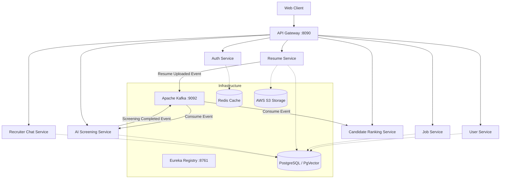
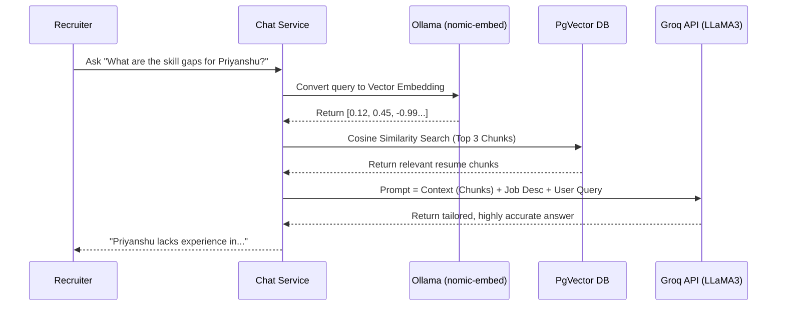

<div align="center">
  <h1>🚀 TalentIQ - AI-Powered Distributed Screening System</h1>
  <p><strong>A highly scalable, event-driven Microservices architecture for automated Resume Parsing, AI Screening, Candidate Ranking, and Conversational RAG (Recruiter Chatbot).</strong></p>
</div>

---

## 📖 Overview
TalentIQ is an enterprise-grade AI-screening platform built using **Java Spring Boot**, **Apache Kafka**, **PostgreSQL (PgVector)**, and **Large Language Models (Groq LLaMA3 & Ollama)**. It solves the problem of manual resume screening by ingesting resumes, parsing them via Apache Tika, processing them asynchronously through Kafka, and leveraging AI to rank candidates against Job Descriptions. It also features a built-in **Recruiter Chatbot** (RAG pipeline) to query candidate profiles dynamically.

---

## 🌟 Key Features
- **Event-Driven Microservices:** Loosely coupled architecture utilizing Apache Kafka for asynchronous inter-service communication.
- **AI Screening & Parsing:** Extracts skills, experience, and projects from PDFs, validating them against active job descriptions.
- **Advanced RAG Pipeline:** Generates semantic embeddings using local `Ollama` (`nomic-embed-text`) and performs vector similarity search in `PgVector` to power the conversational AI Recruiter Chatbot (`Groq`).
- **Resilience & Fault Tolerance:** Circuit Breakers and Retries implemented via `Resilience4j`.
- **Cloud Ready:** Fully Dockerized and deployable on AWS EC2 with robust monitoring via Prometheus and Grafana.

---

## 🏗️ High-Level Architecture
The system consists of **9 specialized Microservices** coordinated by an API Gateway and Eureka Service Registry.



---

## 🧠 Design Patterns Used

1. **Microservices Pattern:** Monolithic application broken down into independent, business-domain-focused services.
2. **Saga Pattern (Choreography):** Distributed transaction management without a central controller. When a resume is uploaded, events flow sequentially: `Uploaded` -> `Parsed` -> `Screened` -> `Ranked`.
3. **API Gateway Pattern:** Centralized entry point for routing, CORS management, and security.
4. **Service Discovery Pattern:** Netflix Eureka dynamically tracks the IP and ports of all scaling microservice instances.
5. **Circuit Breaker Pattern (Resilience4j):** Prevents cascading failures when external APIs (Groq/Ollama) or internal services are down.
6. **Retrieval-Augmented Generation (RAG):** Enhances LLM capabilities by injecting private document context fetched via cosine similarity search from a vector database.

---

## 🤖 RAG Pipeline Flow (Recruiter Chatbot)
How the AI Chatbot understands and answers questions about a specific candidate:



---

## ⚙️ Tech Stack
- **Backend Core:** Java 21, Spring Boot 3.2, Spring Cloud (Netflix Eureka, API Gateway, OpenFeign)
- **AI & LLM:** Spring AI, Groq Cloud (LLaMA 3 70B), Ollama (`nomic-embed-text`)
- **Messaging & Async:** Apache Kafka, Zookeeper
- **Databases:** PostgreSQL, PgVector (Vector DB), Redis (Caching)
- **Infrastructure:** Docker, Docker Compose, AWS EC2, AWS S3
- **Resilience:** Resilience4j (Circuit Breaker, Retry, TimeLimiter)
- **Observability:** Prometheus, Grafana, Micrometer

---

## 🚀 Deployment (AWS EC2)

The entire application runs as a cluster of Docker containers.

```bash
# Clone the repository
git clone https://github.com/Priyanshujaiswal1024/AI-Screening-Distributed-System.git
cd AI-Screening-Distributed-System

# Start Infrastructure (Postgres, Kafka, Zookeeper, Redis, Ollama)
docker compose up -d postgres kafka zookeeper redis ollama

# Pull the embedding model
docker exec talent-ollama ollama pull nomic-embed-text

# Start Microservices
docker compose up -d
```

---

## 🛡️ Future Enhancements
- Kubernetes (K8s) orchestration via Helm charts.
- CI/CD Pipelines via GitHub Actions.
- Implementation of the Transactional Outbox pattern to guarantee 100% Kafka message delivery.

<div align="center">
  <br>
  <b>Developed by Priyanshu Jaiswal</b>
</div>
