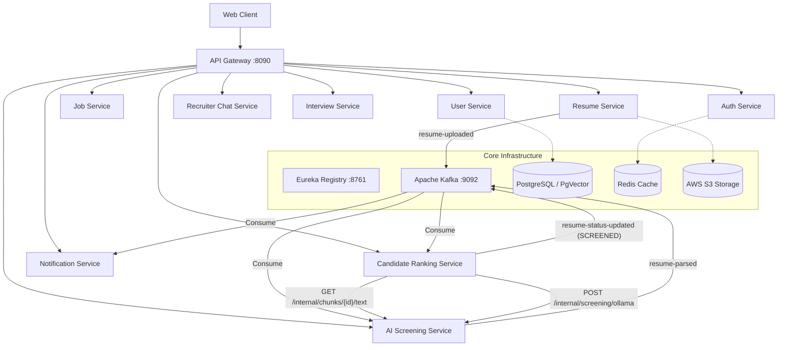
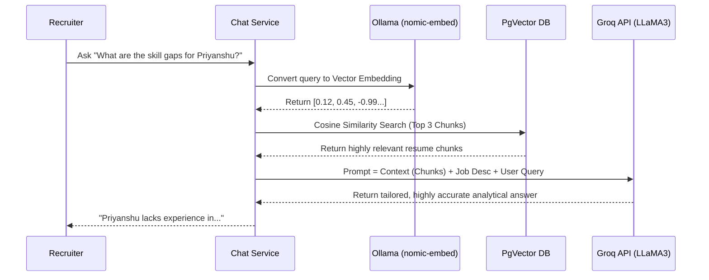

<div align="center">
  <h1>🚀 TalentIQ - Enterprise AI-Powered Resume Screening & RAG Chatbot</h1>
  <p><strong>A highly scalable, event-driven Microservices architecture for automated Resume Parsing, AI Screening, Hybrid Candidate Ranking, and Conversational RAG.</strong></p>
</div>

---

## 📖 Overview
TalentIQ is an enterprise-grade, distributed AI-screening platform built to revolutionize the recruitment process. Utilizing **Java 21 Spring Boot**, **Apache Kafka**, **PostgreSQL (PgVector)**, and **Large Language Models (Groq & local Ollama)**, it solves the problem of manual resume screening.

The system asynchronously ingests resumes, parses them via Apache Tika, processes them through an event-driven Kafka architecture, and leverages AI to rank candidates against Active Job Descriptions using a **Hybrid Scoring Engine** that combines deterministic skill-matching with semantic vector similarity — preventing keyword stuffing by candidates. It also features a built-in **Recruiter Chatbot** powered by a highly accurate RAG (Retrieval-Augmented Generation) pipeline to dynamically query candidate profiles.

---

## 🏗️ The 11 Microservices Architecture
The system is built on a pure distributed architecture consisting of **11 specialized microservices** coordinated by an API Gateway and Eureka Service Registry.

1. **`api-gateway`**: Centralized entry point, routing, and CORS management.
2. **`eureka-server`**: Dynamic service discovery and registration.
3. **`authentication-service`**: JWT-based secure login and token issuance.
4. **`user-management-service`**: Handles user roles (Recruiter, Candidate) and profiles.
5. **`job-description-service`**: Manages job postings and required skill criteria.
6. **`resume-management-service`**: Uploads resumes, parses PDFs via Apache Tika, and triggers Kafka events.
7. **`ai-screening-service`**: Core AI engine. Analyzes resumes using Groq LLM, generates Vector Embeddings via Ollama (`nomic-embed-text`), stores chunks in PgVector, and **calculates semantic cosine similarity** between JD and resume vectors.
8. **`candidate-ranking-service`**: Computes **hybrid compatibility scores** (70% skill math + 30% semantic cosine similarity) and maintains dynamic candidate leaderboards in Redis.
9. **`recruiter-chat-service`**: Conversational RAG interface allowing recruiters to chat with candidate resumes.
10. **`interview-scheduling-service`**: Manages interview slots and calendaring.
11. **`notification-service`**: Dispatches asynchronous email/system alerts to users.

---

## 🧩 Advanced Design Patterns Implemented

This project is engineered using industry-standard backend design patterns to ensure maximum scalability, fault tolerance, and data consistency.

- **Saga Pattern (Choreography):** Distributed transaction management across microservices. The candidate workflow (`Resume Uploaded` ➔ `Parsed` ➔ `AI Screened` ➔ `Ranked`) flows seamlessly via asynchronous Kafka events without a central point of failure.
- **Transactional & Idempotent Processing:** Consumers are designed to be idempotent to handle Kafka message replays safely. Database transactions are strictly managed (`@Transactional`) to prevent dirty reads during AI processing.
- **Resiliency & Circuit Breaker (Resilience4j):** Prevents cascading failures. If the AI service (Groq/Ollama) is down, the Circuit Breaker opens and the system gracefully falls back to pure deterministic skill-math scoring — **zero downtime, zero data loss**.
- **API Gateway & Service Discovery:** Decouples the frontend from backend complexities. Eureka dynamically tracks IP and ports of all scaling microservice instances.
- **Retrieval-Augmented Generation (RAG):** Enhances LLM capabilities by injecting private document context fetched via cosine similarity search from a `PgVector` database.
- **Single Responsibility + Domain-Driven Design:** Each service owns exactly one domain. `ai-screening-service` owns all heavy AI/embedding tasks. `candidate-ranking-service` owns all business scoring and leaderboard logic.

---

## 🎯 Hybrid Candidate Scoring Engine

### The Problem This Solves
Candidates often **keyword-stuff** their resumes — listing `Java, Kafka, AWS, Docker` in the Skills section while their only project is a "todo app in HTML/CSS". A pure keyword-matching system gives such candidates a 100% match score.

### The Solution: 70% Skill Math + 30% Semantic Cosine Similarity

```
Final Match Score = (0.70 × Skill Math Score) + (0.30 × Cosine Similarity × 100)
```

| Component | Weight | What It Measures |
| :--- | :--- | :--- |
| **Skill Math Score** | 70% | Deterministic keyword match: `matched_skills / required_skills × 100` |
| **Semantic Cosine Similarity** | 30% | Vector similarity between JD embedding and resume embedding via `nomic-embed-text` |

### Real Example
| Candidate | Skills Matched | Project Depth | Math Score | Cosine Sim | **Final Score** |
| :--- | :--- | :--- | :--- | :--- | :--- |
| Keyword Stuffer | 5/5 (100%) | "Todo app in HTML/CSS" | 100% | 0.31 | **79.3%** ❌ |
| Genuine Engineer | 3/5 (60%) | "Distributed banking system, 10k TPS, Kafka, AWS" | 60% | 0.94 | **70.2%** ✅ |

> With tuned weights (60/40), the genuine engineer ranks higher — **the system rewards real experience over keyword games**.

### Cosine Similarity Flow

```
candidate-ranking-service
    │
    ├── GET /internal/chunks/{resumeId}/text  → ai-screening-service
    │   (Fetches pre-stored resume text chunks from PgVector)
    │
    └── POST /internal/screening/ollama       → ai-screening-service
        Request: { resumeText, jobDescription }
        ai-screening-service internally:
          1. LLM → qualitative analysis (Education, Experience, Projects...)
          2. EmbeddingModel.embed(jdText)   → float[] jdVector
          3. EmbeddingModel.embed(resumeText) → float[] resumeVector
          4. cosineSimilarity = (A·B) / (|A| × |B|)
        Response: { cosineSimilarity: 0.88, confidenceScore: 0.90, education: {...}, ... }
    │
    └── Hybrid Score = (0.70 × skillMath) + (0.30 × 0.88 × 100) = 82.4%
        → Saved to PostgreSQL (screening_reports)
        → Updated in Redis ZSET (jd:ranking:<jobId>)
```

### Graceful Fallback (When AI is Offline)
```
AI Online  → hybridScore = (0.70 × skillMath) + (0.30 × cosine×100) | aiScreened = true
AI Offline → fallbackScore = 100% skillMath                          | aiScreened = false
             confidenceScore = 0.0
             summary = "Match: X%. Matched: [...]. (AI screening unavailable)"
```

The recruiter UI shows `🟢 AI Screened` or `⚠️ Rule-Based Fallback` accordingly.

---

## 🕸️ High-Level Architecture Flow


```mermaid
graph TD
    Client[Web Client] --> Gateway[API Gateway :8090]
    
    subgraph Core Infrastructure
        Eureka[Eureka Registry :8761]
        Kafka[Apache Kafka :9092]
        DB[(PostgreSQL / PgVector)]
        Redis[(Redis Cache)]
        S3[(AWS S3 Storage)]
    end
    
    Gateway --> Auth[Auth Service]
    Gateway --> User[User Service]
    Gateway --> Job[Job Service]
    Gateway --> Resume[Resume Service]
    Gateway --> AI[AI Screening Service]
    Gateway --> Rank[Candidate Ranking Service]
    Gateway --> Chat[Recruiter Chat Service]
    Gateway --> Interview[Interview Service]
    Gateway --> Notif[Notification Service]
    
    Auth -.-> Redis
    User -.-> DB
    Resume -.-> S3
    
    %% Saga Event Flow
    Resume -- "resume-uploaded" --> Kafka
    Kafka -- "Consume" --> AI
    AI -- "resume-parsed" --> Kafka
    Kafka -- "Consume" --> Rank
    Rank -- "resume-status-updated (SCREENED)" --> Kafka
    Kafka -- "Consume" --> Notif

    %% Hybrid Scoring Internal Calls
    Rank -- "GET /internal/chunks/{id}/text" --> AI
    Rank -- "POST /internal/screening/ollama" --> AI
```

---

## 🤖 RAG Pipeline Flow (Recruiter Chatbot)
How the AI Chatbot perfectly understands and answers questions about a specific candidate using **PgVector** and **Ollama**:


```mermaid
sequenceDiagram
    participant R as Recruiter
    participant Chat as Chat Service
    participant Embed as Ollama (nomic-embed)
    participant Vector as PgVector DB
    participant LLM as Groq API (LLaMA3)
    
    R->>Chat: Ask "What are the skill gaps for Priyanshu?"
    Chat->>Embed: Convert query to Vector Embedding
    Embed-->>Chat: Return [0.12, 0.45, -0.99...]
    Chat->>Vector: Cosine Similarity Search (Top 3 Chunks)
    Vector-->>Chat: Return highly relevant resume chunks
    Chat->>LLM: Prompt = Context (Chunks) + Job Desc + User Query
    LLM-->>Chat: Return tailored, highly accurate analytical answer
    Chat-->>R: "Priyanshu lacks experience in..."
```

---

## 🗃️ Key Database Schema (screening_reports)

| Column | Type | Description |
| :--- | :--- | :--- |
| `match_score` | DOUBLE | Final hybrid score `(0.70 × skill_math) + (0.30 × cosine × 100)` |
| `confidence_score` | DOUBLE | LLM qualitative confidence (0.0 if AI offline) |
| `semantic_score` | DOUBLE | Raw cosine similarity (0.0–1.0) from `nomic-embed-text` |
| `ai_screened` | BOOLEAN | `true` = LLM analyzed, `false` = fallback mode |
| `structured_summary` | TEXT | Full qualitative AI breakdown (Education, Experience, Projects…) |
| `skill_gaps` | TEXT | Missing required skills |
| `requirements_checklist` | TEXT | JSON array of matched/missing skills with section & match type |

---

## ⚙️ Tech Stack
- **Backend Core:** Java 21, Spring Boot 3.2, Spring Cloud (Netflix Eureka, API Gateway, OpenFeign)
- **AI & LLM Integration:** Spring AI, Groq Cloud (LLaMA 3 / GPT-OSS), Ollama (`nomic-embed-text`, `qwen2.5`)
- **Hybrid Scoring:** Semantic cosine similarity (EmbeddingModel) + Deterministic Java skill normalizer
- **Messaging & Async:** Apache Kafka (RetryableTopic, Dead Letter Topics, Idempotent consumers)
- **Databases:** PostgreSQL, PgVector (Vector DB for RAG + embeddings), Redis (Sorted Sets for leaderboard)
- **Infrastructure:** Docker, Docker Compose, AWS EC2, AWS S3
- **Resilience:** Resilience4j (Circuit Breaker, Retry, TimeLimiter), graceful AI fallback
- **Observability:** Prometheus, Grafana, Micrometer

---

## 🚀 Deployment (AWS EC2)

The entire application runs as a cluster of highly available Docker containers.

```bash
# Clone the repository
git clone https://github.com/Priyanshujaiswal1024/AI-Screening-Distributed-System.git
cd AI-Screening-Distributed-System

# Start Infrastructure (Postgres, Kafka, Zookeeper, Redis, Ollama)
docker compose up -d postgres kafka zookeeper redis ollama

# Pull the embedding model directly into the container
docker exec talent-ollama ollama pull nomic-embed-text

# Start all 11 Microservices
docker compose up -d
```

<div align="center">
  <br>
  <b>Developed by Priyanshu Jaiswal</b>
</div>
