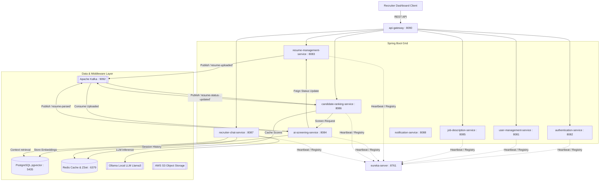
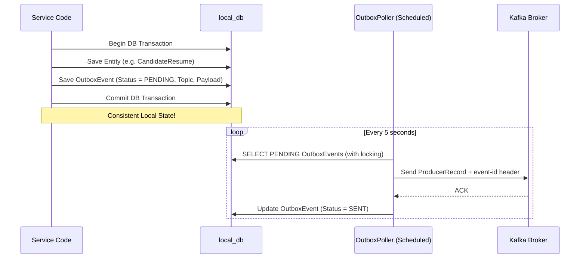
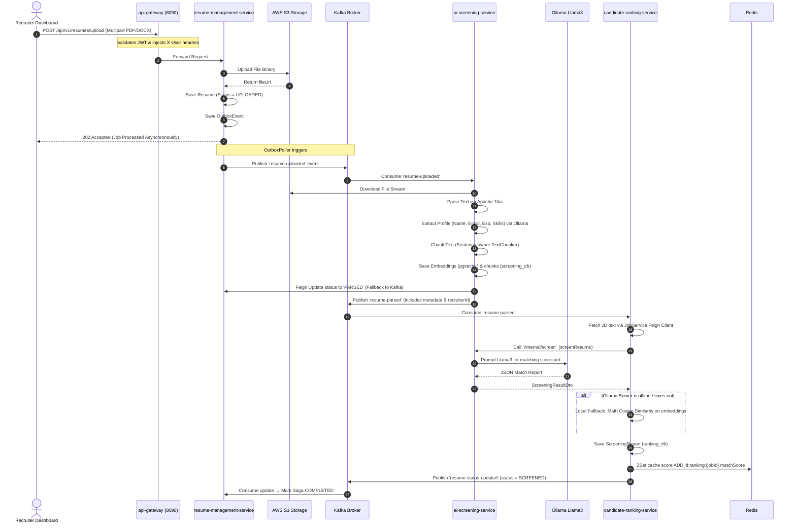
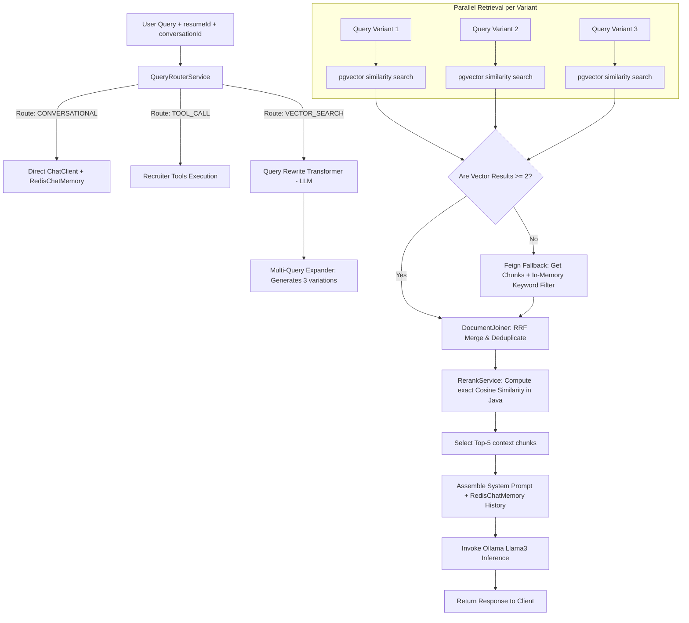
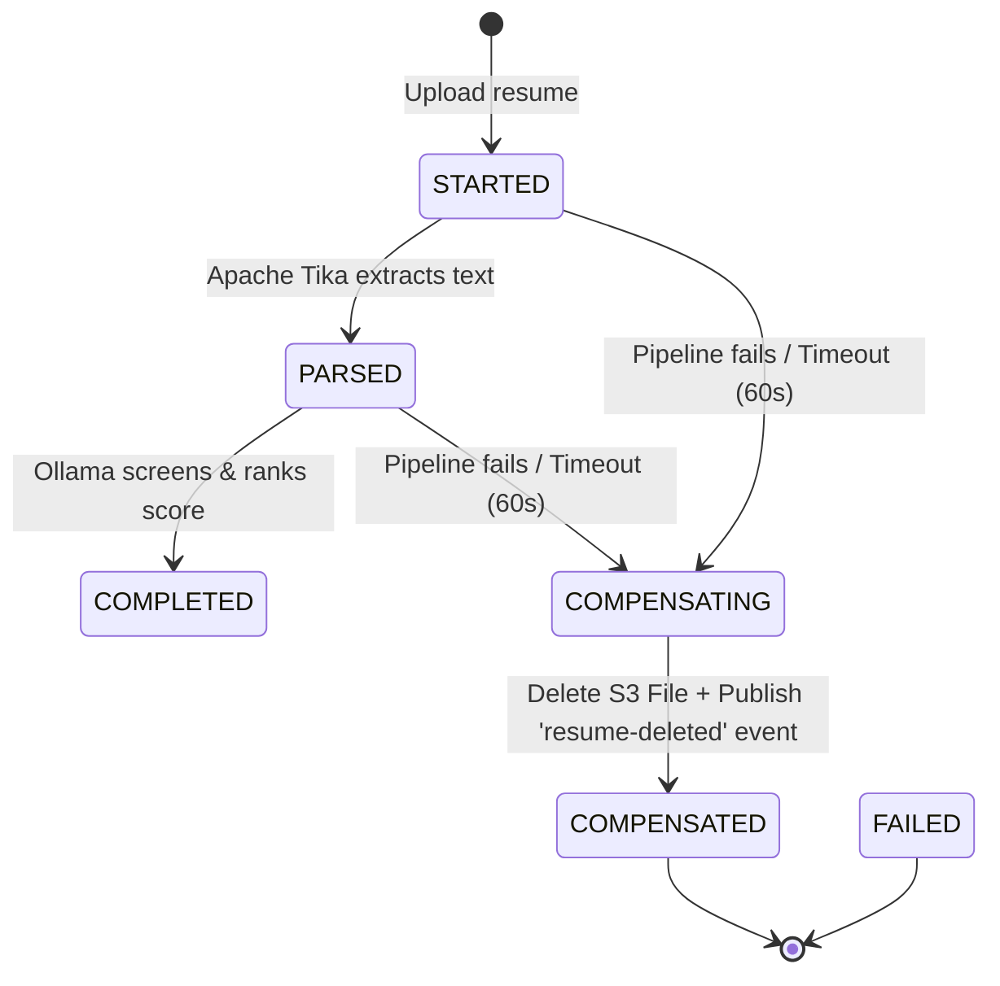

# Talent Intelligence Platform — Comprehensive Backend Analysis & Architecture Report

This report provides a detailed, production-grade architectural analysis and walkthrough of the **Talent Intelligence Platform** backend. It breaks down every component, communication pattern, transaction lifecycle, resilience mechanism, and data structure implemented across your Java microservices.

---

## 1. System Topology & Distributed Service Grid

The backend is built as an event-driven, containerized microservices ecosystem leveraging **Java 21**, **Spring Boot 3.4.0**, and **Spring Cloud**. 



### Microservice Directory & Port Reference Table

| Service Name | Port | Database Name | Key Frameworks & Core Responsibilities |
| :--- | :--- | :--- | :--- |
| **`eureka-server`** | `8761` | *None* | Spring Cloud Netflix Eureka for service registry, heartbeat tracking, and discovery. |
| **`api-gateway`** | `8090` | *None* | Spring Cloud Gateway (Netty), CORS handler, JWT validation, edge claim parsing, and downstream header injection. |
| **`authentication-service`**| `8082` | `auth_db` | Spring Security, JJWT (`Jwts`), signup OTP handling, credentials hashing, JWT token generation, and passwords reset. |
| **`user-management-service`** | `8081` | `user_db` | Recruiter profile records, Spring Security context parser, Kafka consumer for user creation events, and AOP-based idempotency checks. |
| **`job-description-service`** | `8085` | `job_db` | Job details management, required experience parameters, and skills tagging queries. |
| **`resume-management-service`**| `8083` | `resume_db` | Multipart file upload controller, AWS S3 file lifecycle client, Orchestrated SAGA database, and Transactional Outbox publisher. |
| **`ai-screening-service`** | `8084` | `screening_db` | Apache Tika text extractor, sentence-aware TextChunker, Spring AI `VectorStore` (pgvector), and Llama3 extraction prompts. |
| **`candidate-ranking-service`**| `8086` | `ranking_db` | Candidate-job match scoring, Ollama Feign client integration, local cosine vector heuristics fallback, and Redis ZSet cache updates. |
| **`recruiter-chat-service`** | `8087` | `chat_db` | RAG pipeline (Query Rewrite, Multi-Query expansion, Hybrid Vector/Keyword Retrieval, RRF merging, Cosine Reranking, and Redis session memory). |
| **`notification-service`** | `8088` | *None* | Kafka mail alerts consumer, automated OTP trigger emails, and status change notifier hooks. |

---

## 2. Core Architectural & Code Implementation Patterns

### A. Edge Gateway Authentication & Propagation
The edge gateway validates credentials at the system boundary to protect downstream services and maintain low-latency authentication.

1. **Authentication Filter ([AuthenticationFilter.java](file:///c:/Users/HP/Downloads/AI_Screeming/api-gateway/src/main/java/com/talent/platform/apigateway/filter/AuthenticationFilter.java))**:
   - The gateway intercepts requests, parses the `Authorization: Bearer <JWT>` header, and signs it against the local `jwt.secret`.
   - It extracts user identity details (`userId`, `sub` as email, `roles`) and injects them as custom HTTP request headers:
     * `X-User-Email`
     * `X-User-Role`
     * `X-User-Id`
2. **Downstream Security Context ([GatewayHeaderAuthFilter.java](file:///c:/Users/HP/Downloads/AI_Screeming/user-management-service/src/main/java/com/talent/platform/usermanagementservice/config/GatewayHeaderAuthFilter.java))**:
   - Downstream services register a servlet filter that intercepts incoming requests, reads these headers, and sets up a Spring Security `UsernamePasswordAuthenticationToken` in the local `SecurityContextHolder`.
   - This keeps inter-service requests fast since downstream services trust headers sent from the API gateway within the secure inner network.

---

### B. Database-per-Service & Feign Integrations
Direct joins between databases are restricted to prevent data schema coupling.

- **Synchronous Service Joins**: When the `candidate-ranking-service` needs job parameters to rate a resume, it queries the `job-description-service` using declarative **Spring Cloud OpenFeign** clients:
  ```java
  String jdText = jobServiceClient.getJobText(jobId);
  List<String> skills = jobServiceClient.getJobSkills(jobId);
  ```
- **Asynchronous Data Ingestion**: When cross-domain lookups are needed, services subscribe to events like `USER_REGISTERED` and cache necessary fields locally to avoid synchronous REST calls.

---

### C. Write-Through Caching via Redis Sorted Sets (ZSets)
Providing real-time paginated results based on match scores is optimized using Redis.

- **Fast Indexing ([RankingService.java](file:///c:/Users/HP/Downloads/AI_Screeming/candidate-ranking-service/src/main/java/com/talent/platform/candidaterankingservice/service/RankingService.java#L172-L180))**:
  Once a candidate's compatibility score is calculated, the system persists it in PostgreSQL for durability and writes it to Redis under the Sorted Set key `jd:ranking:{jobId}`:
  ```java
  redisTemplate.opsForZSet().add("jd:ranking:" + jobId, resumeId.toString(), matchScore);
  ```
- **Efficient Pagination**: Fetching ranked candidate lists uses the `ZREVRANGE` command, providing `O(log(N) + M)` time complexity. This bypasses slow database sorting operations.

---

### D. Transactional Outbox Pattern
To prevent distributed write failures, publishing events to Kafka uses the **Transactional Outbox Pattern** instead of publishing inside the main database transaction.

1. **State Persistence**: A business transaction updates local tables and stores an event payload in the `OutboxEvent` table within the same ACID database transaction.
2. **Outbox Poller ([OutboxPoller.java](file:///c:/Users/HP/Downloads/AI_Screeming/resume-management-service/src/main/java/com/talent/platform/resumemanagementservice/messaging/OutboxPoller.java))**:
   - A scheduled job runs `outboxEventRepository.findPendingEventsForUpdate()` to read pending events.
   - It publishes the message to Kafka and includes the outbox record ID as an `event-id` header.
   - If writing to Kafka succeeds, the status is updated to `SENT`. If it fails, the poller retries up to 3 times before marking it `FAILED`.



---

### E. Aspect-Oriented Declarative Idempotency
Event-driven consumers use an aspect-based idempotency check to handle duplicate events:

1. **Aspect Interceptor ([IdempotencyAspect.java](file:///c:/Users/HP/Downloads/AI_Screeming/user-management-service/src/main/java/com/talent/platform/usermanagementservice/messaging/IdempotencyAspect.java))**:
   - Any consumer method annotated with `@IdempotentConsumer` is intercepted.
   - The aspect extracts the `event-id` header from the Kafka record.
2. **Deduplication Check ([IdempotencyService.java](file:///c:/Users/HP/Downloads/AI_Screeming/user-management-service/src/main/java/com/talent/platform/usermanagementservice/service/IdempotencyService.java))**:
   - The aspect checks a centralized `processed_events` table.
   - If the `event-id` is found, the duplicate message is skipped.
   - If it is not found, the method executes, and the `event-id` is stored in the database.

---

## 3. End-to-End Request Pipeline Walkthroughs

### Pipeline A: Resume Upload, Ingestion, and AI Screening

This sequence diagram maps the request flow from the initial file upload to vector database indexing and candidate scoring.



---

### Pipeline B: Recruiter Chat RAG Pipeline
The query retrieval flow inside [RagPipelineService.java](file:///c:/Users/HP/Downloads/AI_Screeming/recruiter-chat-service/src/main/java/com/talent/platform/chat/service/RagPipelineService.java) executes when a recruiter queries a candidate's resume:



---

## 4. Resilience, Circuit Breakers, and Fallbacks

Your system integrates **Resilience4j Circuit Breakers** across Feign clients to handle external dependency failures.

### Circuit Breaker Registry Table

| Client Location | Target Service API | Fallback Strategy / Logic | Code Reference |
| :--- | :--- | :--- | :--- |
| **`candidate-ranking-service`** | `ai-screening-service` (`/internal/screen`) | **Cosine Vector Similarity**: Generates text embeddings, calculates cosine distance in Java, and checks keywords against a `0.55` match threshold. | [AIScreeningServiceClientFallbackFactory.java](file:///c:/Users/HP/Downloads/AI_Screeming/candidate-ranking-service/src/main/java/com/talent/platform/candidaterankingservice/client/AIScreeningServiceClientFallbackFactory.java) |
| **`recruiter-chat-service`** | `ai-screening-service` (`/internal/chunks`) | **In-Memory Keywords Filter**: Downloads raw text chunks from the database and filters match keywords using string matching. | [AiScreeningServiceClientFallbackFactory.java](file:///c:/Users/HP/Downloads/AI_Screeming/recruiter-chat-service/src/main/java/com/talent/platform/chat/client/AiScreeningServiceClientFallbackFactory.java) |
| **`ai-screening-service`** | `resume-management-service` (`/status`) | **Kafka Fallback**: Publishes status updates to Kafka instead of the failed REST endpoint to ensure status updates are eventually processed. | [ResumeManagementClientFallbackFactory.java](file:///c:/Users/HP/Downloads/AI_Screeming/ai-screening-service/src/main/java/com/talent/platform/aiscreening/client/ResumeManagementClientFallbackFactory.java) |

### Local Fallback Heuristics Details

#### 1. In-Memory Cosine Similarity
If the AI screening service is down, candidate ranking switches to calculating cosine similarity values directly in Java using the following math formula:
$$\text{Similarity}(\mathbf{A}, \mathbf{B}) = \frac{\mathbf{A} \cdot \mathbf{B}}{\|\mathbf{A}\| \|\mathbf{B}\|} = \frac{\sum_{i=1}^{n} a_i b_i}{\sqrt{\sum_{i=1}^{n} a_i^2} \sqrt{\sum_{i=1}^{n} b_i^2}}$$
- **Heuristic matching**:
  The system loops over the required job skills. For each skill, it queries the embedding model for the skill's coordinates and compares it against each resume text chunk. If the similarity is `>= 0.55`, it flags the skill as **Matched**.

#### 2. REST-to-Kafka Failover
If `ai-screening-service` cannot make a Feign call to update a status to `PARSED` or `SCREENED` on `resume-management-service`, it catches the exception and falls back to Kafka:
```java
try {
    resumeManagementClient.updateResumeStatus(resumeId, status);
} catch (Exception e) {
    log.warn("Feign status update failed... falling back to Kafka event");
    Map<String, Object> statusEvent = new HashMap<>();
    statusEvent.put("resumeId", resumeId.toString());
    statusEvent.put("status", status);
    kafkaTemplate.send("resume-status-updated", resumeId.toString(), statusEvent);
}
```

---

## 5. Event-Driven Messaging Lifecycle & SAGA Patterns

### The Ingestion SAGA Workflow
The system orchestrates the ingestion flow using a saga coordinator inside [SagaOrchestrator.java](file:///c:/Users/HP/Downloads/AI_Screeming/resume-management-service/src/main/java/com/talent/platform/resumemanagementservice/service/SagaOrchestrator.java).



- **Saga Timout Scheduler**: The `SagaTimeoutScheduler` runs on a cron schedule, checks the `SagaInstance` table for records that have exceeded their timeout limit, and triggers compensation for those instances.
- **Saga Compensation**: If a processing step fails, the system executes `compensateSaga(resumeId)`. This deletes the file from S3 and publishes a `resume-deleted` event to clean up downstream database chunks, vector embeddings, and ranking records.

### Kafka Topic Blueprint Table

| Kafka Topic | Producer | Consumer(s) | Payload Structure |
| :--- | :--- | :--- | :--- |
| **`resume-uploaded`** | `resume-management-service` | `ai-screening-service` | `{"resumeId": UUID, "fileUrl": String, "recruiterId": UUID, "jobId": UUID}` |
| **`resume-parsed`** | `ai-screening-service` | `candidate-ranking-service` | `{"resumeId": UUID, "candidateName": String, "candidateEmail": String, "recruiterId": UUID, "totalExperience": Double, "skills": String, "noticePeriod": String, "jobId": UUID}` |
| **`resume-status-updated`**| `ai-screening-service`, `candidate-ranking-service` | `resume-management-service`, `notification-service` | `{"resumeId": UUID, "status": String}` |
| **`resume-deleted`** | `resume-management-service` (Saga) | `ai-screening-service`, `recruiter-chat-service` | `{"resumeId": UUID}` |
| **`user-registered`** | `authentication-service` | `user-management-service`, `notification-service` | `{"email": String, "role": String, "userId": UUID}` |

---

## 6. Data Storage & Search Architecture

### A. Vector Database Embeddings (pgvector)
- **Vector Storage**: The system uses PostgreSQL with the `pgvector` extension to query candidate profiles. Chunks and metadata are saved inside a `vector_store` table.
- **Sentence-Aware Text Chunker**:
  The [TextChunker.java](file:///c:/Users/HP/Downloads/AI_Screeming/ai-screening-service/src/main/java/com/talent/platform/aiscreening/parser/TextChunker.java) tokenizes documents using sentence boundaries (`(?<=[.!?])\\s+`) instead of character lengths.
  - Target chunk size: `800` characters.
  - Chunk overlap: `120` characters.
  - This keeps sentences intact to preserve context for semantic matching.

### B. Reciprocal Rank Fusion (RRF) Retrieval merging
To improve query results in the chatbot, the RAG pipeline expands questions into 3 query variations. The retrieval results for these variations are merged using the RRF algorithm in [DocumentJoinerService.java](file:///c:/Users/HP/Downloads/AI_Screeming/recruiter-chat-service/src/main/java/com/talent/platform/chat/service/DocumentJoinerService.java):
$$RRF\_Score(d \in D) = \sum_{m \in M} \frac{1}{k + r_m(d)}$$
Where:
- $M$ is the set of retrieval runs (from query variations).
- $r_m(d)$ is the position rank of document $d$ in result set $m$.
- $k = 60$ is a standard smoothing constant.
- RRF merges results and balances scores from different search methods (vector similarities, keyword fallback results) without requiring score normalization.

---

## 7. Observability, Monitoring, and Metrics Stack

Your system exposes metrics for visualization and monitoring through a Prometheus and Grafana stack configured in `docker-compose.yml`.

- **Exporter endpoints**:
  - Downstream Spring Boot applications expose application performance metrics via Spring Boot Actuator `/actuator/prometheus`.
  - Cache metrics are exposed using `redis-exporter` (port 9121).
  - Database metrics are exposed using `postgres-exporter` (port 9187).
- **Custom Application Metrics**:
  The system registers custom counters and execution timers in [RankingService.java](file:///c:/Users/HP/Downloads/AI_Screeming/candidate-ranking-service/src/main/java/com/talent/platform/candidaterankingservice/service/RankingService.java#L42-L46) to trace latency and errors:
  - `ranking.redis.updates.total`: Logs Redis Sorted Set update counts (labeled by status: `success` or `failed`).
  - `ranking.calculation.duration`: Logs execution durations for candidate scoring calculations (labeled by `jobId` and status).

---

## 8. Core Source Code Reference Directory

Use these links to access the primary implementations for reference:

- **Edge Security gateway**: [AuthenticationFilter.java](file:///c:/Users/HP/Downloads/AI_Screeming/api-gateway/src/main/java/com/talent/platform/apigateway/filter/AuthenticationFilter.java)
- **Saga Orchestrator Coordinator**: [SagaOrchestrator.java](file:///c:/Users/HP/Downloads/AI_Screeming/resume-management-service/src/main/java/com/talent/platform/resumemanagementservice/service/SagaOrchestrator.java)
- **Transactional Outbox Poller**: [OutboxPoller.java](file:///c:/Users/HP/Downloads/AI_Screeming/resume-management-service/src/main/java/com/talent/platform/resumemanagementservice/messaging/OutboxPoller.java)
- **Document Text Extractor**: [TikaParser.java](file:///c:/Users/HP/Downloads/AI_Screeming/ai-screening-service/src/main/java/com/talent/platform/aiscreening/parser/TikaParser.java)
- **Sentence Chunker**: [TextChunker.java](file:///c:/Users/HP/Downloads/AI_Screeming/ai-screening-service/src/main/java/com/talent/platform/aiscreening/parser/TextChunker.java)
- **AI Screening service**: [AIScreeningService.java](file:///c:/Users/HP/Downloads/AI_Screeming/ai-screening-service/src/main/java/com/talent/platform/aiscreening/service/AIScreeningService.java)
- **Match Score calculation & Fallbacks**: [RankingService.java](file:///c:/Users/HP/Downloads/AI_Screeming/candidate-ranking-service/src/main/java/com/talent/platform/candidaterankingservice/service/RankingService.java)
- **Declarative Idempotency Aspect**: [IdempotencyAspect.java](file:///c:/Users/HP/Downloads/AI_Screeming/user-management-service/src/main/java/com/talent/platform/usermanagementservice/config/GatewayHeaderAuthFilter.java)
- **RAG Chat Orchestration pipeline**: [RagPipelineService.java](file:///c:/Users/HP/Downloads/AI_Screeming/recruiter-chat-service/src/main/java/com/talent/platform/chat/service/RagPipelineService.java)
- **Reciprocal Rank Fusion Joiner**: [DocumentJoinerService.java](file:///c:/Users/HP/Downloads/AI_Screeming/recruiter-chat-service/src/main/java/com/talent/platform/chat/service/DocumentJoinerService.java)
- **Cosine Reranker**: [RerankingService.java](file:///c:/Users/HP/Downloads/AI_Screeming/recruiter-chat-service/src/main/java/com/talent/platform/chat/service/RerankingService.java)
