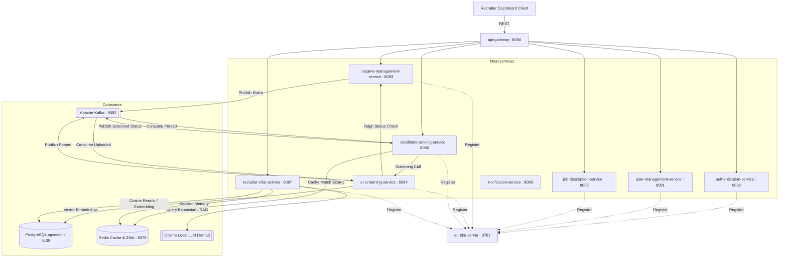
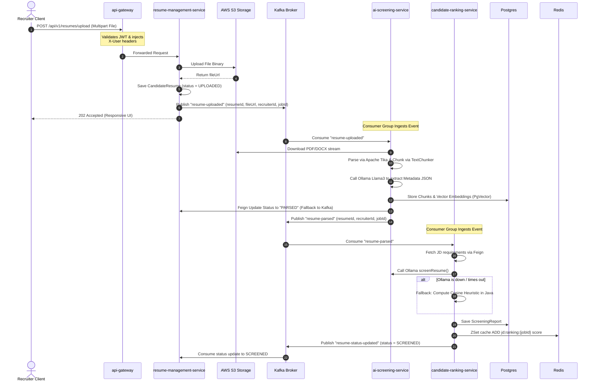
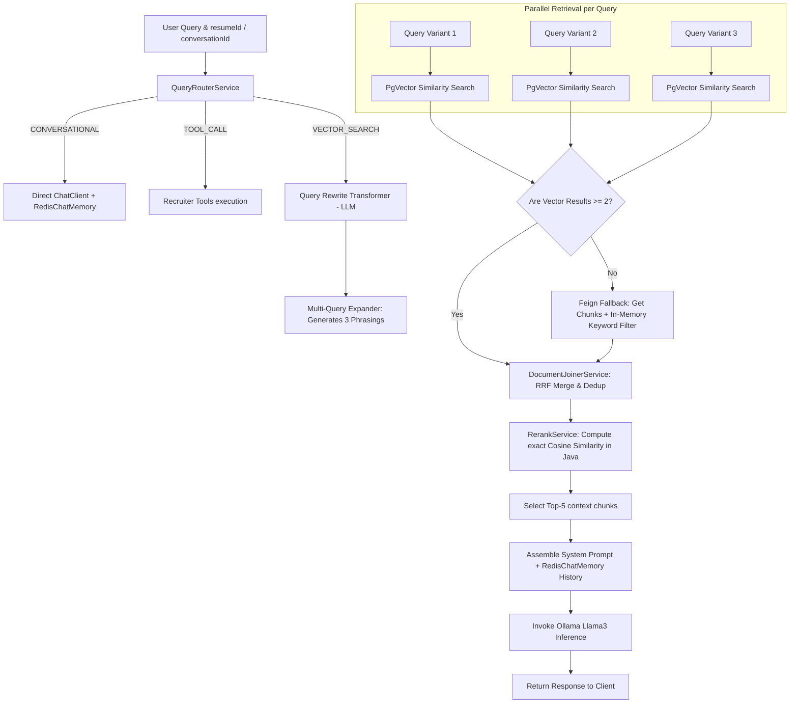

# Talent Intelligence Platform — Backend Architecture & Interview Study Guide

This document provides a highly detailed, professional-grade analysis of your **Talent Intelligence Platform** backend. It is designed to prepare you for senior system design, microservices, and backend engineering interview rounds. It maps every technical pattern, request flow, and design trade-off directly to your active Java codebase.

---

## 1. Distributed Microservices Topology

The platform is designed as a distributed, event-driven microservices architecture built on **Java 21** and **Spring Boot 3.4.0**. The services communicate asynchronously using **Apache Kafka** and synchronously using **Spring Cloud OpenFeign** and **Spring Cloud Gateway**.



### Service Grid Reference Table

| Service Name | Port | Primary Database | Key Stack Components / Responsibilities |
| :--- | :--- | :--- | :--- |
| **`eureka-server`** | `8761` | *None* | Spring Cloud Netflix Eureka for service registry and discovery. |
| **`api-gateway`** | `8090` | *None* | Spring Cloud Gateway (Netty), Cors configurations, JWT validation, claims injection. |
| **`authentication-service`**| `8082` | `auth_db` | User credentials, OTP generation, token signing (`Jwts`), signup/login handler. |
| **`user-management-service`** | `8081` | `user_db` | Recruiter profile data, GatewayHeaderAuthFilter, user metadata queries. |
| **`job-description-service`** | `8085` | `job_db` | Job description creation, key skills tagging, minimum experience configuration. |
| **`resume-management-service`**| `8083` | `resume_db` | Resume upload handler, raw file storage to AWS S3, transactional status updates. |
| **`ai-screening-service`** | `8084` | `screening_db` | Apache Tika parser, sentence-aware chunking, PgVector storage, LLM extraction. |
| **`candidate-ranking-service`**| `8086` | `ranking_db` | Ollama-based match scoring, heuristic cosine fallback, Redis ZSet caching. |
| **`recruiter-chat-service`** | `8087` | `chat_db` | RAG chatbot (query expansion, rewriting, hybrid retrieval, cosine reranking). |
| **`notification-service`** | `8088` | *None* | Kafka event consumer, automated OTP and status email triggers. |

---

## 2. Core Architectural Patterns & Code Implementation

To excel in senior interviews, you must articulate the **why** and **how** behind the specific design choices implemented in your codebase.

### A. API Gateway Validation & Downstream Propagation
In your system, downstream microservices do **not** perform expensive JWT validation. Instead, the Netty-based Gateway handles authentication at the edge and propagates user identities.

1. **Gateway Edge Ingestion**: [AuthenticationFilter.java](file:///c:/Users/HP/Downloads/AI_Screeming/api-gateway/src/main/java/com/talent/platform/apigateway/filter/AuthenticationFilter.java) validates the incoming authorization header (`Bearer <JWT>`), parses claims (`userId`, `roles`, `sub`), and injects custom HTTP headers:
   * `X-User-Email`
   * `X-User-Role`
   * `X-User-Id`
2. **Downstream Context Injection**: The Spring Security context in downstream services (e.g., [GatewayHeaderAuthFilter.java](file:///c:/Users/HP/Downloads/AI_Screeming/user-management-service/src/main/java/com/talent/platform/usermanagementservice/config/GatewayHeaderAuthFilter.java)) extracts these trusted headers and immediately populates the `SecurityContextHolder`:
   ```java
   String email = request.getHeader("X-User-Email");
   String role  = request.getHeader("X-User-Role");
   if (email != null && !email.isBlank()) {
       var authority = new SimpleGrantedAuthority("ROLE_" + (role != null ? role : "RECRUITER"));
       var auth = new UsernamePasswordAuthenticationToken(email, null, List.of(authority));
       SecurityContextHolder.getContext().setAuthentication(auth);
   }
   ```
   > [!NOTE]
   > **Interview Tip**: Explain that this prevents the downstream database round-trips to validate signatures and keeps inter-service requests fast. Downstream services run behind a private virtual network and reject any external requests that bypass the Gateway.

---

### B. Database-per-Service & Distributed Query Joins
To maintain loose coupling, each service has its own dedicated database engine (enforced via separate schemas in Docker Compose). Direct cross-database joins are **forbidden**.

* **Synchronous Feign Joins**: When `candidate-ranking-service` requires a job description or job skills to compute rankings, it calls `job-description-service` using Feign client queries:
  ```java
  String jdText = jobServiceClient.getJobText(jobId);
  List<String> skills = jobServiceClient.getJobSkills(jobId);
  ```
* **Asynchronous Kafka Replication**: For lookup structures (e.g., matching recruiter info), services consume events like `USER_REGISTERED` to populate localized lookup entities rather than calling the auth service synchronously.

---

### C. Write-Through Caching via Redis Sorted Sets (ZSets)
A key bottleneck is providing recruiters with real-time, paginated lists of candidates sorted by compatibility score. Reading from a relational database and sorting on-the-fly fails at scale.

* **High-Speed Cache Ingestion**: Inside [RankingService.java](file:///c:/Users/HP/Downloads/AI_Screeming/candidate-ranking-service/src/main/java/com/talent/platform/candidaterankingservice/service/RankingService.java#L172-L180), once scoring is computed, the score is saved in PostgreSQL for durability, and the score index is immediately updated in Redis under `jd:ranking:{jobId}`:
  ```java
  redisTemplate.opsForZSet().add("jd:ranking:" + jobId, resumeId.toString(), matchScore);
  ```
* **Pagination Complexity**: Reading the rank list requires a simple `ZREVRANGEBYSCORE` or `ZREVRANGE` command, providing `O(log(N) + M)` lookup complexity, resulting in sub-millisecond retrieval speeds for the frontend.

---

### D. Idempotent Consumer & Resilient Kafka Fallbacks
In event-driven architectures, network partitions cause duplicated messages.

1. **Idempotence Constraint**: Consumers (e.g., `AuthEventConsumer` or `ResumeUploadedConsumer`) use the **Read-Before-Write / Unique Constraint** design pattern. They query database entities (like checking `recruiterRepository.existsByEmail(email)`) before executing transactions, combined with database unique constraints.
2. **REST-to-Event Fallback**: A critical resiliency pattern resides in [AIScreeningService.java](file:///c:/Users/HP/Downloads/AI_Screeming/ai-screening-service/src/main/java/com/talent/platform/aiscreening/service/AIScreeningService.java). Updating the database status is attempted synchronously over REST (Feign). If Feign fails due to network issues, it fails over to publish an asynchronous status event to Kafka:
  ```java
  try {
      resumeManagementClient.updateResumeStatus(resumeId, "PARSED");
  } catch (Exception fe) {
      log.warn("Feign status update failed, falling back to Kafka event: {}", fe.getMessage());
      kafkaTemplate.send("resume-status-updated", resumeId.toString(), 
          Map.of("resumeId", resumeId.toString(), "status", "PARSED"));
  }
  ```

---

## 3. End-to-End Request Pipeline Walkthroughs

Use these step-by-step flows to explain system runtime mechanics during system design walkthroughs.

### Pipeline A: The Resume Ingestion & Processing Pipeline



---

### Pipeline B: The RAG & Recruiter Chat Pipeline

This pipeline details the advanced retrieval processes inside [RagPipelineService.java](file:///c:/Users/HP/Downloads/AI_Screeming/recruiter-chat-service/src/main/java/com/talent/platform/chat/service/RagPipelineService.java).



---

## 4. Advanced Interview Q&A Bank

Here is a curated bank of advanced questions, traps, and best answers customized for your system.

### Q1. Why did you choose a sentence-aware chunking strategy instead of fixed character length?
* **Spoken Answer**: "If you cut a document exactly every 500 characters, you will split sentences and words in half. This breaks the context for vector search. By splitting on sentences using regular expressions and keeping an overlap of 120 characters, we ensure each block contains complete thoughts and the AI understands the resume context much better."
* **Technical details**: Refer to [TextChunker.java](file:///c:/Users/HP/Downloads/AI_Screeming/ai-screening-service/src/main/java/com/talent/platform/aiscreening/parser/TextChunker.java#L14-L41). It uses sentence-boundary regex `(?<=[.!?])\\s+` to tokenize sentences. Chunks are aggregated up to `TARGET_CHUNK_CHARS = 800` with an overlap of `OVERLAP_CHARS = 120`. If a sentence exceeds boundaries, the last 120 characters of the preceding chunk are appended as the starting buffer of the next chunk.
* **Why it matters**: Keeping sentence structures intact preserves key semantic dependencies (like verb-object linkages), which directly increases vector similarity matching scores.

### Q2. How does your system recover if the local Ollama LLM goes down during candidate screening?
* **Spoken Answer**: "LLM processing is heavy and prone to timeouts. If Ollama goes down, my system has a built-in mathematical fallback. In `candidate-ranking-service`, if the screening REST call fails, the service falls back to calculating vector similarities manually. It generates embedding coordinates for the job description and candidate chunks, runs a cosine similarity calculation in Java, and flags matched versus missing keywords. This ensures we still rank candidates, and the system remains functional."
* **Technical details**: See [RankingService.java](file:///c:/Users/HP/Downloads/AI_Screeming/candidate-ranking-service/src/main/java/com/talent/platform/candidaterankingservice/service/RankingService.java#L115-L163). In the fallback, the system loops over job requirement keywords, gets their vector coordinates from `EmbeddingModel`, and computes similarity using:
  $$\text{Similarity} = \frac{\mathbf{A} \cdot \mathbf{B}}{\|\mathbf{A}\| \|\mathbf{B}\|}$$
  If the maximum similarity of a skill embedding against the chunk embeddings exceeds `0.55` (`SKILL_MATCH_THRESHOLD`), it marks the skill as **Matched**, otherwise it is **Unmatched**.

### Q3. How do you handle chat history storage in a stateless microservice?
* **Spoken Answer**: "Since our services are containerized and scaled stateless, we cannot keep chat history in the server memory. We use Redis. We implemented `RedisChatMemory` using Spring AI. Each conversation has a unique ID, and we store the message history as a serialized JSON list in Redis. During a new request, we retrieve the conversation history, format it into the system prompt, and send it to the LLM."
* **Technical details**: Refer to [RedisChatMemory.java](file:///c:/Users/HP/Downloads/AI_Screeming/recruiter-chat-service/src/main/java/com/talent/platform/chat/memory/RedisChatMemory.java). It implements Spring AI's `ChatMemory` interface. Conversation states are stored using Redis hashes or string lists, managed via the `StringRedisTemplate`.

### Q4. What is the benefit of using Reciprocal Rank Fusion (RRF) in your RAG pipeline?
* **Spoken Answer**: "When a user asks a question, we expand it into 3 queries to find the best information. Each query returns its own list of documents. RRF is a math formula that merges these lists. It scores each document based on its position in the results. If a document appears near the top across multiple queries, its score goes up. This lets us find the most relevant resume sections, even if the candidate worded them differently."
* **Technical details**: See [DocumentJoinerService.java](file:///c:/Users/HP/Downloads/AI_Screeming/recruiter-chat-service/src/main/java/com/talent/platform/chat/service/DocumentJoinerService.java#L26-L59). The RRF formula utilized is:
  $$RRF\_Score(d \in D) = \sum_{m \in M} \frac{1}{k + r_m(d)}$$
  Where $k = 60$ (constant), and $r_m(d)$ is the rank of document $d$ in result set $m$. RRF handles different scales of search scores (like vector cosine distance vs. BM25 keyword score) without needing normalization.

---

## 5. Architectural Trade-Off Analysis (The "Why" Round)

Interviewers frequently probe your decision-making boundaries. Be ready to explain the trade-offs of your choices.

### Monolith vs. Microservices
* **Your Design**: Microservices (eureka-server, api-gateway, 8 downstream services).
* **The Trade-off**:
  * *Pros*: Decouples high-CPU tasks (Tika document parsing, vector embedding generation, LLM inference) from light transactional tasks (recruiter logins, job management). A spike in resume uploads will exhaust CPU cores on `ai-screening-service` but will not impact recruiter logins on `authentication-service`.
  * *Cons*: Introduced high networking overhead, distributed debugging complexities, and eventual consistency lag.

### PgVector vs. Dedicated Vector Database (e.g., Pinecone, Milvus)
* **Your Design**: PostgreSQL with the `pgvector` extension.
* **The Trade-off**:
  * *Pros*: Zero sync lag. Candidate details and semantic embeddings live inside the same database transaction. Queries can join structured relational fields (e.g., `experience_years >= 5`) and vector cosine distance in a single SQL statement.
  * *Cons*: pgvector HNSW index builds require high database RAM and CPU, which can impact standard relational read/write queries under extreme scale.

### Kafka vs. RabbitMQ
* **Your Design**: Apache Kafka commit-log broker.
* **The Trade-off**:
  * *Pros*: Stream replay capability. If we modify our embedding model or sentence chunking logic, we can reset our consumer offsets and replay historical resume upload streams to re-index all resumes.
  * *Cons*: Heavy infrastructure overhead (requires ZooKeeper or KRaft coordination). Higher latency compared to lightweight AMQP brokers like RabbitMQ.

---

## 6. Observability & Monitoring Strategy

Your project includes a complete monitoring stack defined in [docker-compose.yml](file:///c:/Users/HP/Downloads/AI_Screeming/docker-compose.yml#L53-L149).

* **Instrumentation**: Downstream Spring Boot applications expose metrics via Micrometer and Prometheus endpoints (`/actuator/prometheus`).
* **Scraping Engine**: Prometheus pulls metrics from the microservices, databases (via postgres-exporter), and caches (via redis-exporter) every 15 seconds.
* **Custom Counters**: Custom business metrics (like `ranking.redis.updates.total` and execution duration timer `ranking.calculation.duration`) are monitored in [RankingService.java](file:///c:/Users/HP/Downloads/AI_Screeming/candidate-ranking-service/src/main/java/com/talent/platform/candidaterankingservice/service/RankingService.java#L42-L46) to identify inference bottlenecks.
* **Alertmanager**: Triggers notifications when services or database pools become saturated.

---

## 7. Key Code Reference Directory

Use these links to review the core implementations before your interview sessions:

* **Authentication Edge**: [AuthenticationFilter.java (API Gateway)](file:///c:/Users/HP/Downloads/AI_Screeming/api-gateway/src/main/java/com/talent/platform/apigateway/filter/AuthenticationFilter.java)
* **Downstream Access Security**: [GatewayHeaderAuthFilter.java (User Service)](file:///c:/Users/HP/Downloads/AI_Screeming/user-management-service/src/main/java/com/talent/platform/usermanagementservice/config/GatewayHeaderAuthFilter.java)
* **Document Parser**: [TikaParser.java (AI Screening Service)](file:///c:/Users/HP/Downloads/AI_Screeming/ai-screening-service/src/main/java/com/talent/platform/aiscreening/parser/TikaParser.java)
* **Text Chunking**: [TextChunker.java (AI Screening Service)](file:///c:/Users/HP/Downloads/AI_Screeming/ai-screening-service/src/main/java/com/talent/platform/aiscreening/parser/TextChunker.java)
* **Inference Pipeline**: [AIScreeningService.java (AI Screening Service)](file:///c:/Users/HP/Downloads/AI_Screeming/ai-screening-service/src/main/java/com/talent/platform/aiscreening/service/AIScreeningService.java)
* **Match Scoring**: [RankingService.java (Candidate Ranking Service)](file:///c:/Users/HP/Downloads/AI_Screeming/candidate-ranking-service/src/main/java/com/talent/platform/candidaterankingservice/service/RankingService.java)
* **Query Routing**: [QueryRouterService.java (Recruiter Chat Service)](file:///c:/Users/HP/Downloads/AI_Screeming/recruiter-chat-service/src/main/java/com/talent/platform/chat/service/QueryRouterService.java)
* **RAG Orchestrator**: [RagPipelineService.java (Recruiter Chat Service)](file:///c:/Users/HP/Downloads/AI_Screeming/recruiter-chat-service/src/main/java/com/talent/platform/chat/service/RagPipelineService.java)
* **Rank Fusion**: [DocumentJoinerService.java (Recruiter Chat Service)](file:///c:/Users/HP/Downloads/AI_Screeming/recruiter-chat-service/src/main/java/com/talent/platform/chat/service/DocumentJoinerService.java)
* **Similarity Ranker**: [RerankingService.java (Recruiter Chat Service)](file:///c:/Users/HP/Downloads/AI_Screeming/recruiter-chat-service/src/main/java/com/talent/platform/chat/service/RerankingService.java)
