# Talent Intelligence Platform — User Signup to Candidate Screening Flow

This document details the end-to-end runtime lifecycle of the **Talent Intelligence Platform**. It maps the sequence from a recruiter's initial signup and profile verification to job description setup, resume upload, vector database indexing, LLM matching, and Redis caching.

---

## 1. System-Wide Sequence Diagram

The following Mermaid sequence diagram traces requests across all microservices, databases, the message broker, and local LLM/cache layers.

```mermaid
sequenceDiagram
    autonumber
    actor Recruiter as Recruiter Dashboard
    participant Gateway as api-gateway (8090)
    participant Auth as authentication-service
    participant Notif as notification-service
    participant UserSvc as user-management-service
    participant JobSvc as job-description-service
    participant ResumeSvc as resume-management-service
    participant S3 as AWS S3 Storage
    participant Kafka as Kafka Broker
    participant AIScreen as ai-screening-service
    participant Ollama as Ollama Llama3 (Local AI)
    participant RankSvc as candidate-ranking-service
    participant Redis as Redis Cache

    %% ==========================================
    %% PHASE 1: RECRUITER SIGNUP & PROFILE CREATION
    %% ==========================================
    rect rgb(26, 54, 93)
        Note over Recruiter, UserSvc: Phase 1: User Signup, OTP Verification & Profile Creation
    end
    Recruiter->>Gateway: POST /api/v1/auth/signup-otp (Email, Password, Name)
    Gateway->>Auth: Forward Request
    Auth->>Auth: Generate OTP & Cache Registration State
    Auth->>Kafka: Publish 'user-registered' OTP Event
    Auth-->>Recruiter: 200 OK (OTP Sent)
    
    Kafka->>Notif: Consume OTP Event
    Notif->>Recruiter: Send Verification Email (OTP Code)

    Recruiter->>Gateway: POST /api/v1/auth/verify-otp (Email, OTP)
    Gateway->>Auth: Forward Request
    Auth->>Auth: Validate OTP & Save Credentials (auth_db)
    Auth->>Kafka: Publish 'user-registered' Event (Complete Profile)
    Auth-->>Recruiter: 201 Created (User Registered)

    Kafka->>UserSvc: Consume 'user-registered' (Idempotency aspect checks DB)
    UserSvc->>UserSvc: Save Recruiter Profile in user_db

    %% ==========================================
    %% PHASE 2: LOGIN & TOKEN GENERATION
    %% ==========================================
    rect rgb(44, 122, 123)
        Note over Recruiter, Auth: Phase 2: Authentication & Token Issuance
    end
    Recruiter->>Gateway: POST /api/v1/auth/login (Email, Password)
    Gateway->>Auth: Forward Request
    Auth->>Auth: Validate Credentials & Sign JWT (userId, role, sub)
    Auth-->>Recruiter: 200 OK (Return JWT Bearer Token)

    %% ==========================================
    %% PHASE 3: JOB DESCRIPTION CREATION
    %% ==========================================
    rect rgb(113, 128, 150)
        Note over Recruiter, JobSvc: Phase 3: Job Description Provisioning
    end
    Recruiter->>Gateway: POST /api/v1/jobs (Job Details, Required Skills) + [JWT Header]
    Note over Gateway: Gateway validates JWT signature & injects custom X-User headers
    Gateway->>JobSvc: Forward Request with X-User-Id, X-User-Role, X-User-Email
    JobSvc->>JobSvc: Populate SecurityContext & Save Job Description (job_db)
    JobSvc-->>Recruiter: 201 Created (Return jobId)

    %% ==========================================
    %% PHASE 4: RESUME UPLOAD & SAGA INGESTION
    %% ==========================================
    rect rgb(74, 85, 104)
        Note over Recruiter, AIScreen: Phase 4: Resume Ingestion, Parsing & Indexing
    end
    Recruiter->>Gateway: POST /api/v1/resumes/upload (Multipart PDF, jobId) + [JWT Header]
    Note over Gateway: Gateway validates JWT & injects X-User headers
    Gateway->>ResumeSvc: Forward Request with X-User headers
    ResumeSvc->>S3: Upload File Binary
    S3-->>ResumeSvc: Return S3 fileUrl
    ResumeSvc->>ResumeSvc: Save Resume as UPLOADED (resume_db)
    ResumeSvc->>ResumeSvc: Initialize SAGA state (STARTED)
    ResumeSvc->>ResumeSvc: Save transactional OutboxEvent (PENDING)
    ResumeSvc-->>Recruiter: 202 Accepted (Processing Pipeline Initiated)

    Note over ResumeSvc, Kafka: OutboxPoller scheduled job reads outbox event
    ResumeSvc->>Kafka: Publish 'resume-uploaded' event (with event-id header)

    %% ==========================================
    %% PHASE 5: AI SCREENING & pgvector STORAGE
    %% ==========================================
    rect rgb(45, 55, 72)
        Note over Kafka, Ollama: Phase 5: Text Extraction, Embeddings & Metadata Parsing
    end
    Kafka->>AIScreen: Consume 'resume-uploaded'
    AIScreen->>S3: Download File Stream
    AIScreen->>AIScreen: Extract Text via Apache Tika (TikaParser)
    AIScreen->>Ollama: Prompt Llama3 to extract Name, Email, Skills, Experience
    Ollama-->>AIScreen: JSON Extracted Metadata Profile
    AIScreen->>AIScreen: Split Text (Sentence-aware Chunker: 800 chars target / 120 overlap)
    AIScreen->>AIScreen: Store Chunks & pgvector Embeddings (screening_db)
    AIScreen->>ResumeSvc: Feign: Update status to 'PARSED' (Fallback to Kafka)
    AIScreen->>Kafka: Publish 'resume-parsed' event (metadata + recruiterId + jobId)

    %% ==========================================
    %% PHASE 6: CANDIDATE RANKING & CACHING
    %% ==========================================
    rect rgb(26, 54, 93)
        Note over Kafka, Redis: Phase 6: Score Calculations, Fallbacks & Sorted Set Caching
    end
    Kafka->>RankSvc: Consume 'resume-parsed'
    RankSvc->>JobSvc: Feign: Fetch Job Description text & required skills
    JobSvc-->>RankSvc: Return JD Details
    RankSvc->>AIScreen: Call `/internal/screen` (screenResume)
    AIScreen->>Ollama: Prompt Llama3 to evaluate match scorecard
    Ollama-->>AIScreen: Return Evaluation Scorecard
    AIScreen-->>RankSvc: ScreeningResultDto
    
    alt Ollama is down / times out
        RankSvc->>RankSvc: Fallback: Compute in-memory Cosine Similarity on embeddings
    end

    RankSvc->>RankSvc: Save ScreeningReport (ranking_db)
    RankSvc->>Redis: ZSet cache score ADD jd:ranking:{jobId} matchScore
    RankSvc->>Kafka: Publish 'resume-status-updated' (status = SCREENED)
    
    Kafka->>ResumeSvc: Consume status update → Mark Saga COMPLETED
```

---

## 2. Step-by-Step Walkthrough

### Phase 1: User Signup, Verification, and Profile Initialization
1. **Signup request**: The user submits registration details to `/api/v1/auth/signup-otp`. The `authentication-service` validates format constraints, hashes the proposed password, generates an OTP token, and publishes a `user-registered` registration event to Kafka.
2. **OTP Notification**: The `notification-service` consumes the OTP event and emails the verification OTP token to the user.
3. **Verification check**: The recruiter submits the code to `/api/v1/auth/verify-otp`. Upon verification, credentials are saved in `auth_db`. The service then publishes a final `user-registered` confirmation event.
4. **Profile creation**: The `user-management-service` consumes this event. An Aspect-Oriented interceptor ([IdempotencyAspect.java](file:///c:/Users/HP/Downloads/AI_Screeming/user-management-service/src/main/java/com/talent/platform/usermanagementservice/config/GatewayHeaderAuthFilter.java)) validates the unique transaction ID to ensure profile creation is idempotent. The recruiter profile is then saved in `user_db`.

### Phase 2: Login and Token Generation
5. **Inbound validation**: The recruiter calls `/api/v1/auth/login`. The `authentication-service` verifies credentials, signs a JSON Web Token (JWT) with user roles and unique ID claims, and returns the Bearer Token to the client.

### Phase 3: Job Description Setup
6. **Token inspection**: The recruiter creates a job by sending a POST request to `/api/v1/jobs` with the JWT header.
7. **Downstream delegation**: The Netty-based `api-gateway` validates the token's cryptographic signature at the edge. It translates token claims into trusted HTTP headers (`X-User-Id`, `X-User-Email`, `X-User-Role`) and forwards the request.
8. **Entity persistence**: The `job-description-service` handles the request, loads claims into the thread security context via `GatewayHeaderAuthFilter`, and saves the tagged job description requirements in `job_db`.

### Phase 4: Resume Upload and Saga Ingestion
9. **S3 upload**: The recruiter uploads a candidate's resume (PDF/DOCX) against a `jobId`.
10. **State transition**: The `api-gateway` validates the request and routes the multipart binary to `resume-management-service`. This service uploads the binary to AWS S3 and receives the permanent `fileUrl`.
11. **Transactional Outbox pattern**: The resume is stored in `resume_db` as `UPLOADED`. The service starts a new **SAGA transaction orchestration pipeline**, saving the state in `SagaInstance` and writing a `PENDING` event to the `OutboxEvent` table. The API returns a `202 Accepted` status code to the client.
12. **Outbox publishing**: A scheduled `OutboxPoller` thread polls the database, reads the event, and publishes a `resume-uploaded` message to the Kafka broker.

### Phase 5: Parsing and Text Embedding
13. **Apache Tika parsing**: The `ai-screening-service` consumes the `resume-uploaded` event. It downloads the file from AWS S3 and extracts the raw text stream using Apache Tika.
14. **Profile extraction**: It prompts the local Ollama LLM to parse profile metadata (Candidate Name, Email, Notice Period, Skills, Experience) in JSON format.
15. **Vector storage**: The [TextChunker](file:///c:/Users/HP/Downloads/AI_Screeming/ai-screening-service/src/main/java/com/talent/platform/aiscreening/parser/TextChunker.java) splits the text at sentence boundaries (800-character target, 120-character overlap) to preserve context. These chunks and their 768-dimensional coordinates are stored in PostgreSQL using `pgvector`.
16. **State notification**: The screening service calls the resume service via Feign (or fallback Kafka topic) to advance the saga state to `PARSED`. It then broadcasts a `resume-parsed` event to Kafka.

### Phase 6: Score Calculations and Cache Writing
17. **JD retrieval**: The `candidate-ranking-service` consumes the `resume-parsed` event. It fetches the corresponding job description and skills matrix via Feign.
18. **Evaluation scorecard**: The ranking service calls the screening service's `/internal/screen` endpoint to score the candidate using Ollama Llama3.
19. **Resilience fallback**: If the LLM is down, the service falls back to calculating the cosine similarity of the chunks and checking skill terms using local mathematical methods.
20. **Redis Sorted Sets (ZSets)**: The service writes a durability report in `ranking_db` and adds the calculated score index to a Redis ZSet key:
    `jd:ranking:{jobId}` -> score = `matchScore`, member = `resumeId`
21. **Saga completion**: The ranking service publishes a `resume-status-updated` status event with a value of `SCREENED`. The resume service consumes this event and updates the SAGA transaction to `COMPLETED`.
